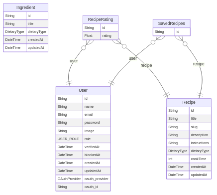

# Smart Recipe Generator

## Tech Stack

1. NextJS
2. Prisma and MongoDB
3. Dockerised MongoDB
4. Tailwind + CSS
5. NextAuth for Authentication

## Setup

After cloning the repo, install the deps

```bash
pnpm install
```

Copy .env.eg to .env

```bash
cp .env.eg .env
```

Spin up Mongo Instance locally, in case MongoAtlas env avaialable skip it, and shove MongoURI in env

```bash
docker compose up -d
```

Apply collection and indexes on mongo & Generate Client for prisma

```bash
pnpm prisma db push && pnpx prisma generate
```

Run seed

```bash
pnpx prisma db seed
```

Run the server, at port 3000

```
pnpm dev
```

Open [http://localhost:3000](http://localhost:3000) with your browser to see the result.

# Approach

### **0. ER Diagram**



### **1. Recipe Matching Algorithm**

- **Step 1**: User inputs/selects ingredients (text input).
- **Step 2**: Fetch all available recipes in the db where at least one of the input ingredients matches.
- **Step 3**: Score the recipes based on:
  - **Ingredient Match Percentage**: Calculate based on the number of matching ingredients wrt to the total input ingredients.
  - **Dietary Type**: Match user preferences (e.g., veg, non-veg).
- **Step 4**: Return a list of matching recipes sorted by match percentage.

---

### **2. Dietary Restrictions Handling**

- Users can specify dietary preferences during onboarding.
- **Filtering Logic**:
  - Recipes are filtered based on the `dietaryType` field in the **Recipe** model.

---

### **3. Recommended Recipes Logic**

- **User Authentication**:
  - Check if the user is logged in; otherwise, redirect to the login page.
- **Fetching Saved Recipes**:
  - Retrieve all saved recipes for the logged-in user from the **SavedRecipes** table.
  - If no saved recipes exist, display a message.
- **Extracting Ingredients**:
  - Extract unique ingredient IDs from the saved recipes.
- **Finding Recommended Recipes**:
  - Query the **Recipe** table for recipes that contain any of the extracted ingredient IDs.
  - Exclude recipes that the user has already saved.
- **Fetching Ingredient Details**:
  - Retrieve ingredient details (title, nutritional profile) for the recommended recipes.
- **Final Recipe Mapping**:
  - Format the data for display, including mapped ingredient details.
- **Rendering**:
  - Display the recommended recipes using the `RecipeList` component.
  - If no recommendations are found, show a fallback message.

---

### **4. Database Schema Usage**

- **User Management**:

  - Users sign up via email/password.
  - Authenticated users can rate and save recipes (**RecipeRating**, **SavedRecipes** models).

- **Recipe Storage & Retrieval**:

  - Recipes are stored in MongoDB with structured fields (`title`, `ingredients`, `instructions`).
  - Recipes reference **Ingredient** documents via `RecipeIngredient.ingredientId`.
  - Recipes have ratings (**RecipeRating**) and user interactions (**SavedRecipes**).

- **Ingredient Storage**:
  - **Ingredient** documents contain nutritional data (`NutritionalProfile`).
  - Used for filtering based on health-related parameters (calories, protein, etc.).

---

### **5. Documentation & Code Quality**

- **Documentation**:
  - Provide a README with setup instructions.
- **Code Quality**:
  - Use TypeScript for type safety.
  - Implement modular components and reusable functions.
  - Use Prisma migrations for database schema updates.
